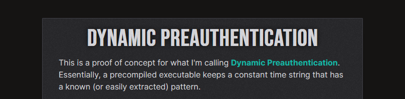
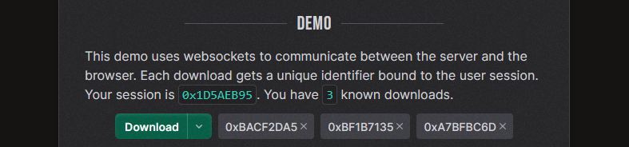

# dynamic-preauth

[][demo]

<!-- TODO: Add badges -->
<!-- TODO: Add links to Railway deployment -->

A proof of concept for server-side modification of executables for pre-authentication, built with Rust ([Salvo][salvo]).

## About

I've had this idea for a while now, that you could 'pre-authenticate' an executable, right before it's downloaded by a user.
While complex and with a host of security/pipeline concerns, it had a certain benefit that seems otherwise unattainable: authentication without user interaction.

This project is a proof of concept for that idea, using Rust and Salvo to build a server that can inject a user's authentication token into an executable before it's served to them.

[][demo]

## How it works

1. At build time, the server has release builds for the major target platforms built. They are made available to the server at runtime.
2. At runtime, the server locates constant time variables within the executable, and remembers their location.
3. When a user requests an executable, the server injects the user's authentication token into the executable, overwriting whatever was located at the remembered location.

Now, when the user runs the executable, it will have the user's authentication token embedded within it - no recompilation or sidecar files required.
The executable keeps a hash of the original values, so it knows if the value has been changed.

This application demonstrates the concept of authentication via Websockets. Downloading a new executable will create a new identifier, which is remembered by the server.

In the browser, all download identifiers are shown, and running any executable will tell the server to notify the browser of the download (a sound will play and a visual effect for the relevant identifier will appear).

## Docker

This application is carefully constructed via the [Dockerfile](Dockerfile), built with [Railway][railway] in mind.

- The [demo](./demo/src/main.rs) application is built for Windows and Linux x64 targets with the `rust:latest` image.
- The [server](./src/main.rs) is built for Linux with the `rust:alpine` image.
- The [frontend](./frontend) is built with `node:latest` and pre-compressed with Gzip, Brotli, and Zstd.
- The final application stage is ran on `alpine:latest`.

[demo]: https://dynamic-preauth.xevion.dev
[railway]: https://railway.app
[salvo]: https://salvo.rs
